<h1>Table of Contents</h1>

- [Installation](#installation)
  - [Standard folder](#standard-folder)
  - [Custom folder](#custom-folder)
- [Usage](#usage)
  - [From main menu (extension menu)](#from-main-menu-extension-menu)
  - [From designer menu (right click on opened form, table, etc)](#from-designer-menu-right-click-on-opened-form-table-etc)
- [Addins](#addins)
  - [Create Batch](#create-batch)
    - [Step 1 : Enter name and select project](#step-1--enter-name-and-select-project)
    - [Step 2 : Select label file and enter label id and description](#step-2--select-label-file-and-enter-label-id-and-description)
    - [Step 3 : (Repeated) Enter label text for a given language](#step-3--repeated-enter-label-text-for-a-given-language)
    - [Result](#result)
  - [Create Form](#create-form)
    - [Step 1 : Enter name and select project](#step-1--enter-name-and-select-project-1)
    - [Step 2 : Select label file and enter label id and description](#step-2--select-label-file-and-enter-label-id-and-description-1)
    - [Step 3 : (Repeated) Enter label text for a given language](#step-3--repeated-enter-label-text-for-a-given-language-1)
    - [Result](#result-1)
  - [Auto Fill Pattern Design](#auto-fill-pattern-design)
    - [Step 1 : Select pattern and option](#step-1--select-pattern-and-option)
    - [Result](#result-2)
    - [Informations](#informations)

# Installation

You must download the addins dlls that you want to use along with the common [SOG_SharedUtils.dll](dlls/SOG_SharedUtils.dll)

You have two options for where to put them at, the standard addins folder or a custom one

## Standard folder

To locate the standard folder you may go through the following manipulation using the system environment variables :

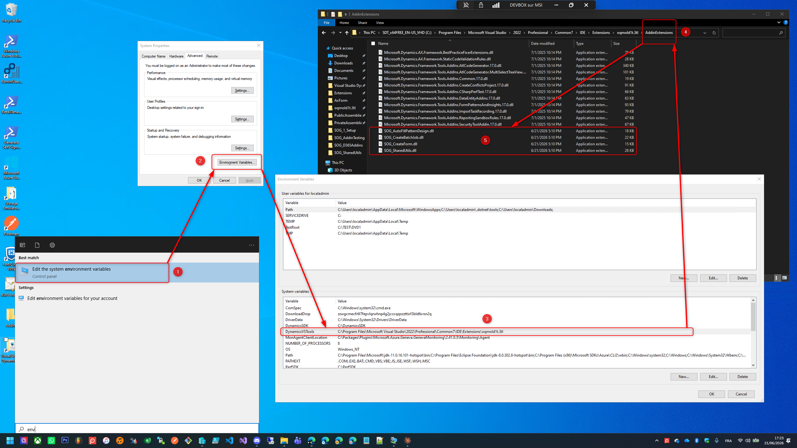

## Custom folder

You have the possibility to put your dlls in a custom folder by adding a line to the following configuration file :

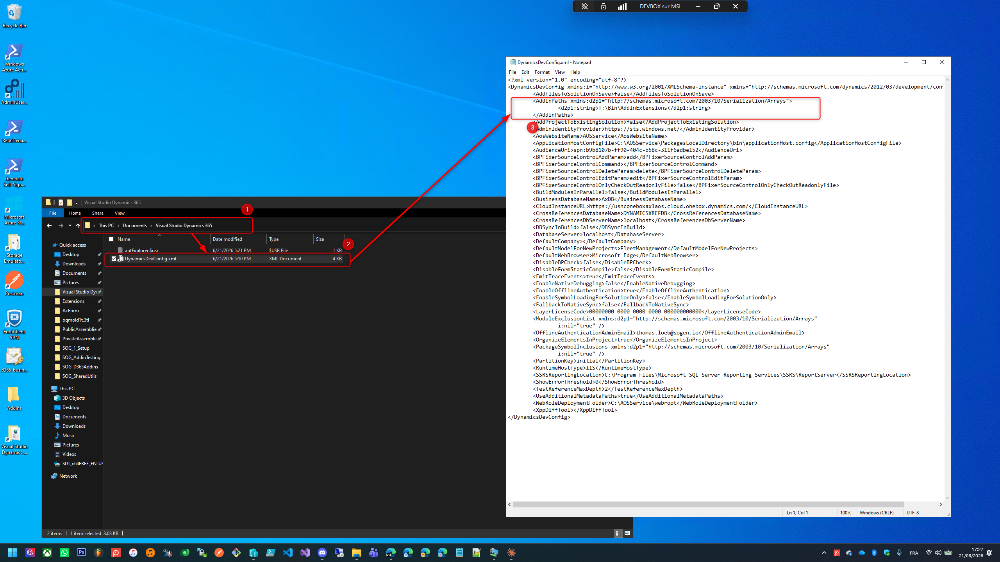

# Usage

## From main menu (extension menu)

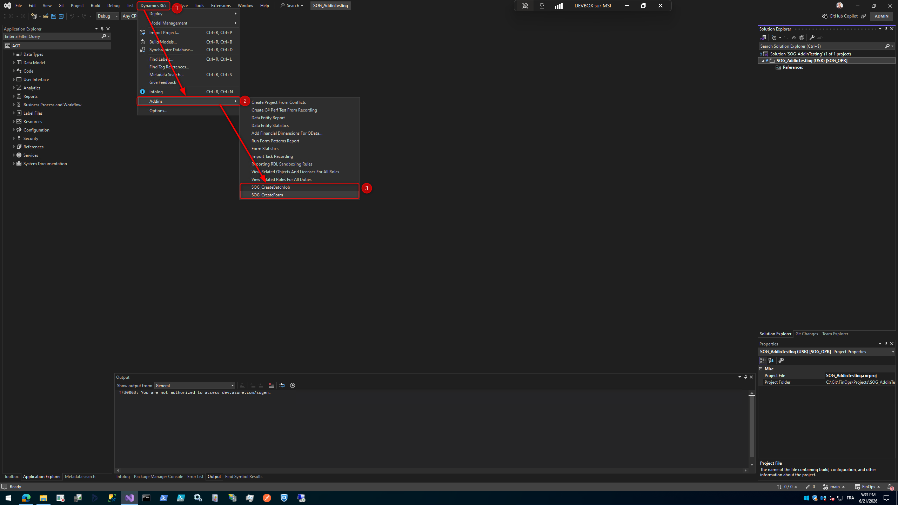

## From designer menu (right click on opened form, table, etc)

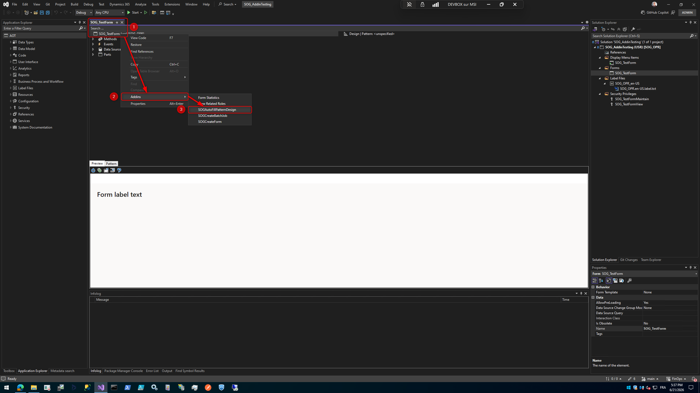

# Addins

## Create Batch

This addin lets you create a new Batch Job which implies the following components :
- Contract class (with samples)
- Service class (with samples)
- Controller class (ready to be used)
- Action menu item
- Maintain privilege
- Labels & Links between components

### Step 1 : Enter name and select project

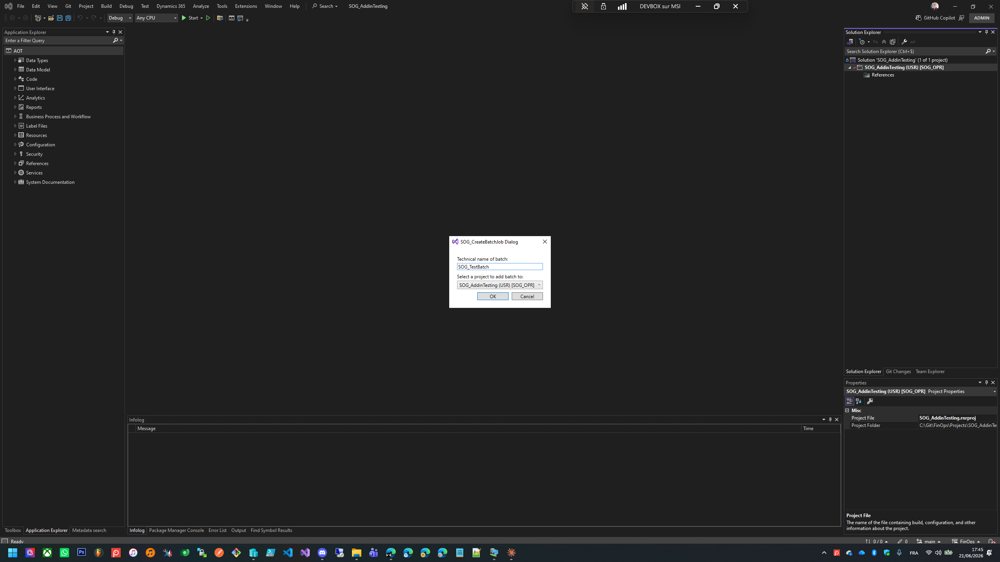

### Step 2 : Select label file and enter label id and description

### Step 3 : (Repeated) Enter label text for a given language

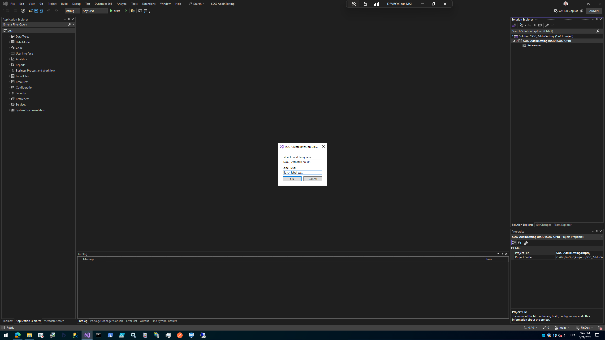

### Result

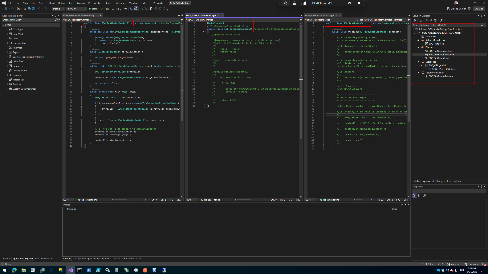

## Create Form

This addin lets you create a new Form which implies the following components :
- Form
- Display menu item
- View & Maintain privilege
- Labels & Links between components

### Step 1 : Enter name and select project

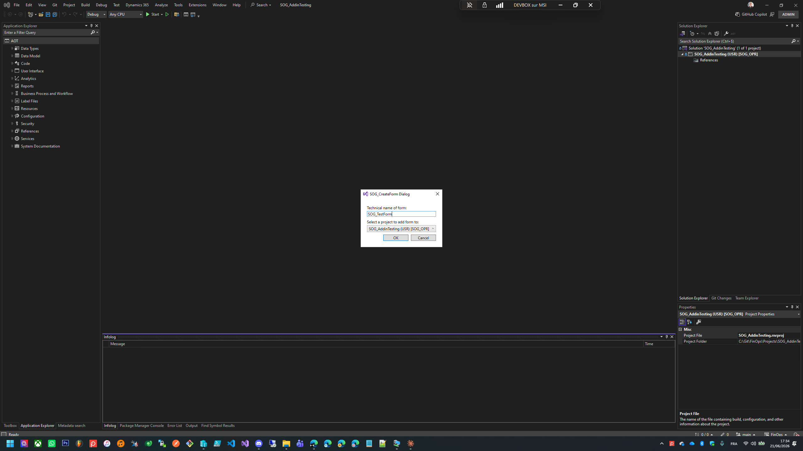

### Step 2 : Select label file and enter label id and description

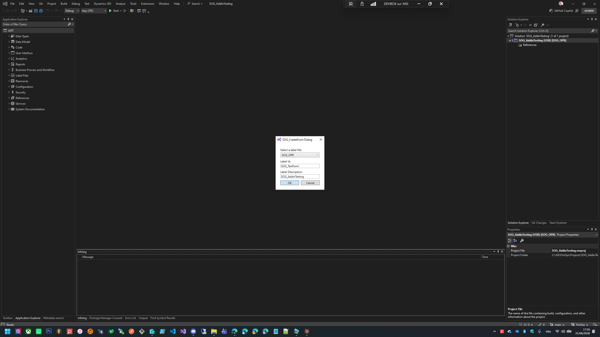

### Step 3 : (Repeated) Enter label text for a given language

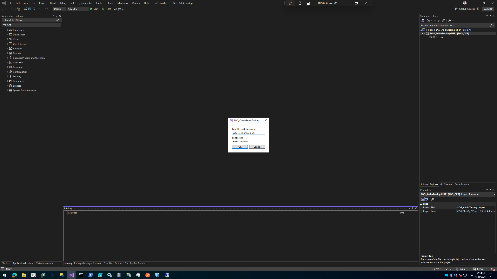

### Result

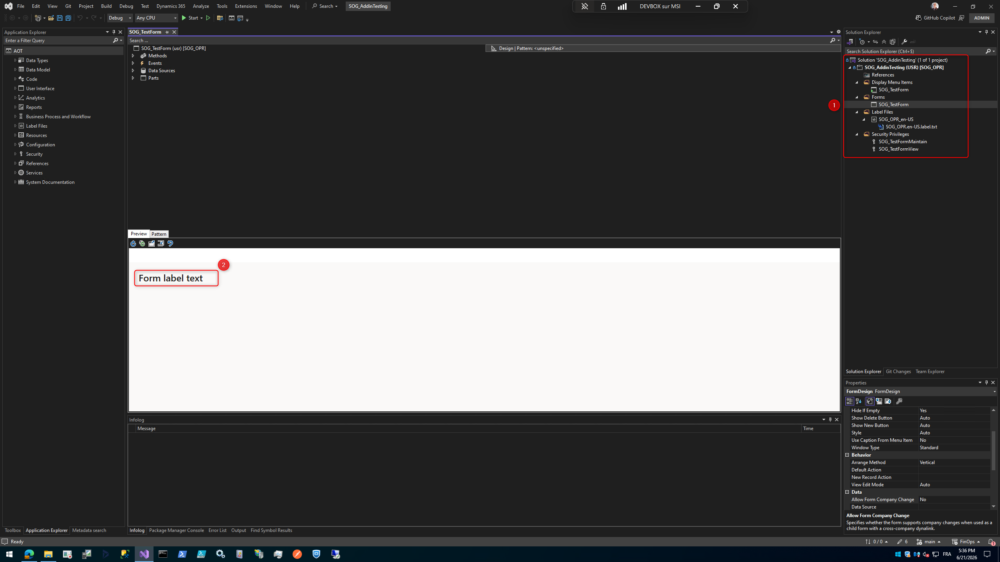

## Auto Fill Pattern Design

This addin lets you select a pattern for a form design and fills automatically the controls in the pattern's tree

### Step 1 : Select pattern and option

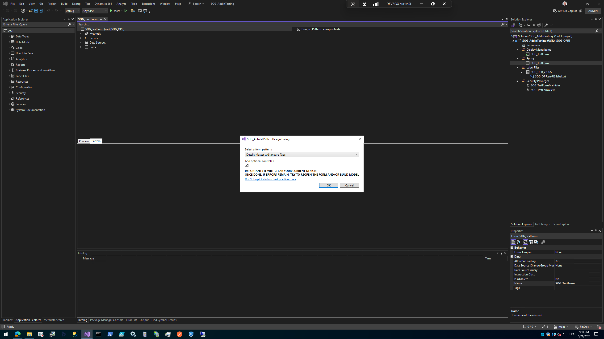

### Result

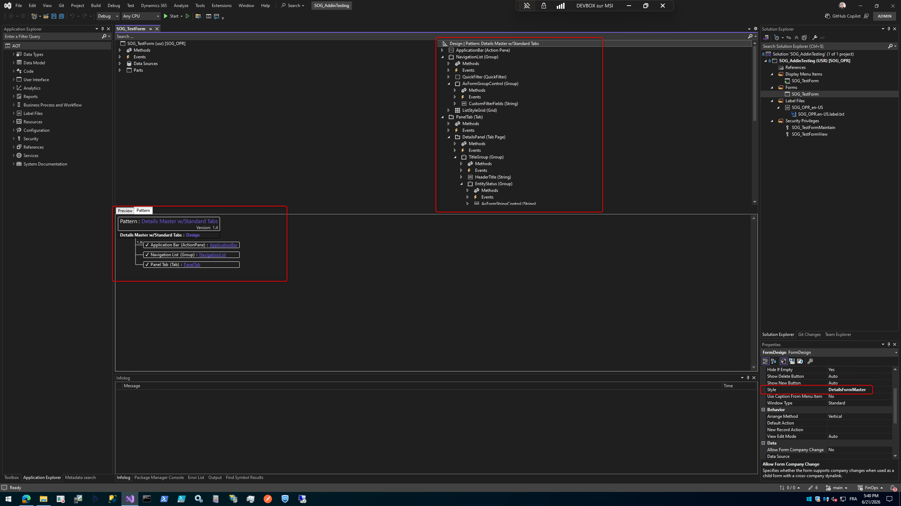

### Informations

When checking the "Add optionnal controls ?" option, the addin will perform creation even for "0..n" subcontrols and keep its recursive behavior on those controls

When crossing a subpattern choice, the addin will select the only pattern if there is only one, if multiple, it will let the user decide after completion

Those points are clearly identified here :

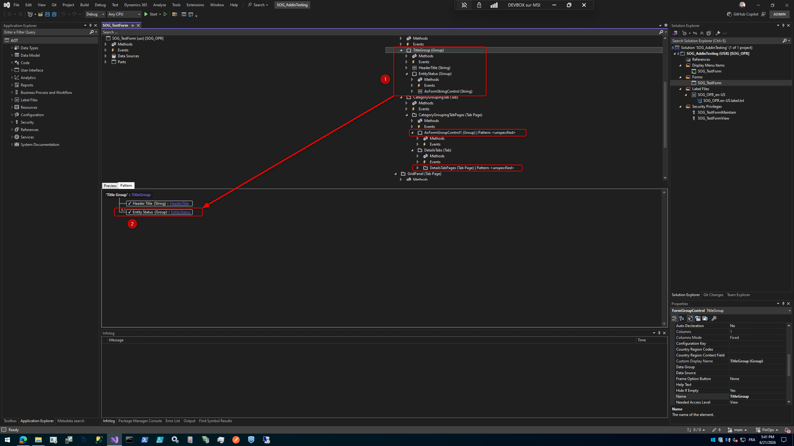
